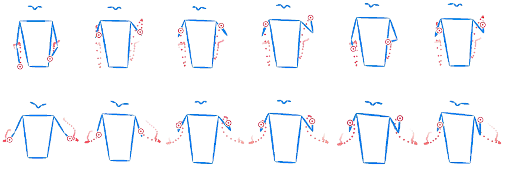

# Taming Diffusion Models for Music-driven Conducting Motion Generation

## Overview


<br/>

- Generated conducting motion according to the given music -- Tchaikovsky Piano Concerto No.1:

    https://github.com/viiika/Diffusion-Conductor/assets/40078051/d993df28-29a0-4520-a429-19fb2cc0a546

<!-- <br/> -->
<!-- Generated conducting motion according to given music -- Beethoven Symphony No.7:

https://github.com/viiika/Diffusion-Conductor/assets/40078051/3bf56f68-6d3e-441a-91a5-3235930200f8 -->


<!-- ## Overview of the proposed framework

 -->

### Features
- Objective: We present **Diffusion-Conductor**, a novel DDIM-based approach for music-driven conducting motion generation.
- Contributions: 
    - First work to use diffusion model for
music-driven conducting motion generation.
    - Modify the supervision signal from `ε` to `x0` to achieve
the better performances, which will inspire later research on motion generation field.
- Benchmark Performance: Ourperform state-of-the-art methods on all four metrics: MSE, FGD, BC, Diversity.

## News

- 18/07/2023: Our paper won the Best Paper Award for AAAI 2023 Inangural Summer Symposium!

## Getting Started

### Installation

Please refer to [install.md](/Diffusion_Stage/install.md) for detailed installation.

### Training

#### Prepare the ConductorMotion100 dataset:

- The training set：https://pan.baidu.com/s/1Pmtr7V7-9ChJqQp04NOyZg?pwd=3209
- The validation set：https://pan.baidu.com/s/1B5JrZnFCFvI9ABkuJeWoFQ?pwd=3209 
- The test set：https://pan.baidu.com/s/18ecHYk9b4YM5YTcBNn37qQ?pwd=3209 

You can also access the dataset via [**Google Drive**](https://drive.google.com/drive/folders/1I2eFM-vEbqVXtD4sUPmGFSeNZeu_5JMu?usp=sharing)

There are 3 splits of *ConductorMotion100*: train, val, and test. They respectively correspond to 3 `.rar` files. After extract them to `<Your Dataset Dir>` folder, the file structure will be:

```
tree <Your Dataset Dir>
<Your Dataset Dir>
    ├───train
    │   ├───0
    │   │       mel.npy
    │   │       motion.npy
    |  ...
    │   └───5268
    │           mel.npy
    │           motion.npy
    ├───val
    │   ├───0
    │   │       mel.npy
    │   │       motion.npy
    |  ...
    │   └───290
    │           mel.npy
    │           motion.npy
    └───test
        ├───0
        │       mel.npy
        │       motion.npy
       ...
        └───293
                mel.npy
                motion.npy
```

Each `mel.npy` and `motion.npy` are corresponded to <u>60 seconds</u> of Mel spectrogram and motion data. Their sampling rates are respectively <u>90 Hz</u> and <u>30 Hz</u>. The Mel spectrogram has 128 frequency bins, therefore `mel.shape = (5400, 128)`. The motion data contains 13 2d keypoints, therefore `motion.shape = (1800, 13, 2)`

#### Train the music encoder and motion encoder in Contrastive_Stage with the following command:

```shell 
cd Contrastive_Stage
```

```
python M2SNet_train.py --dataset_dir <Your Dataset Dir> 
```

#### Train the diffusion model in Diffusion_Stage with the following command:
```shell
cd Diffusion_Stage
```
```shell
PYTHONPATH="$(dirname $0)/..":$PYTHONPATH \
python3 -u tools/train.py \
    --name checkpoint_folder_name \
    --batch_size 32 \
    --times 25 \
    --num_epochs 400 \
    --dataset_name ConductorMotion100 \
    --data_parallel \
    --gpu_id 1 2
```

### Inference and Visualization
```shell
cd Diffusion_Stage
```
```shell
PYTHONPATH="$(dirname $0)/..":$PYTHONPATH \
python -u tools/visualization.py \
    --motion_length 6 \
    --gpu_id 5 \
    --result_path "conduct_example.mp4"
```

### Download the pretrained model
For evaluation and inference, you may download the contrastive stage pretrained model and the diffusion stage pretrained model from [GoogleDrive](https://drive.google.com/drive/folders/1l2jvAudk6w5UuAKH3ZMM20qLChmkegb2?usp=drive_link).

## Acknowledgement
We would like to thank to the great projects in [VirtualConductor](https://github.com/ChenDelong1999/VirtualConductor) and [MotionDiffuse](https://github.com/mingyuan-zhang/MotionDiffuse).


## Papers

1. Zhuoran Zhao and Jinbin Bai* and Delong Chen and Debang Wang and Yubo Pan. [Taming Diffusion Models for Music-driven Conducting Motion Generation](https://arxiv.org/abs/2306.10065)

    ```bibtex
    @misc{zhao2023taming,
      title={Taming Diffusion Models for Music-driven Conducting Motion Generation}, 
      author={Zhuoran Zhao and Jinbin Bai and Delong Chen and Debang Wang and Yubo Pan},
      year={2023},
      eprint={2306.10065},
      archivePrefix={arXiv},
      primaryClass={eess.AS}
    }
    ```
