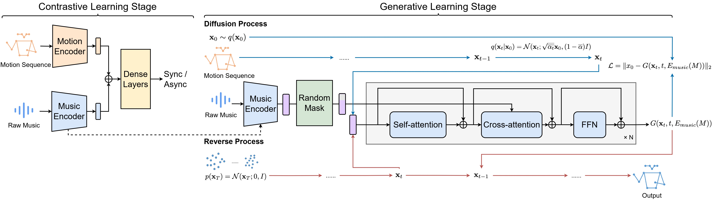

# Taming Diffusion Models for Music-driven Conducting Motion Generation

Generated conducting motion according to given music -- Beethoven Symphony 7:


# Overview of the proposed framework



# News
- 26/05/2023: Our paper has been accepted by AAAI 2023 Inaugural Summer Symposium Series - AI x Metaverse!


# Getting Started

## Installation

Please refer to [install.md](/Diffusion_Stage/install.md) for detailed installation.

## Training

### Prepare the ConductorMotion100 dataset:

- The training set：https://pan.baidu.com/s/1Pmtr7V7-9ChJqQp04NOyZg?pwd=3209
- The validation set：https://pan.baidu.com/s/1B5JrZnFCFvI9ABkuJeWoFQ?pwd=3209 
- The test set：https://pan.baidu.com/s/18ecHYk9b4YM5YTcBNn37qQ?pwd=3209 

You can also access the dataset via [**Google Drive**](https://drive.google.com/drive/folders/1I2eFM-vEbqVXtD4sUPmGFSeNZeu_5JMu?usp=sharing)

There are 3 splits of *ConductorMotion100*: train, val, and test. They respectively correspond to 3 `.rar` files. After extract them to `<Your Dataset Dir>` folder, the file structure will be:

```
tree <Your Dataset Dir>
<Your Dataset Dir>
    ├───train
    │   ├───0
    │   │       mel.npy
    │   │       motion.npy
    |  ...
    │   └───5268
    │           mel.npy
    │           motion.npy
    ├───val
    │   ├───0
    │   │       mel.npy
    │   │       motion.npy
    |  ...
    │   └───290
    │           mel.npy
    │           motion.npy
    └───test
        ├───0
        │       mel.npy
        │       motion.npy
       ...
        └───293
                mel.npy
                motion.npy
```

Each `mel.npy` and `motion.npy` are corresponded to <u>60 seconds</u> of Mel spectrogram and motion data. Their sampling rates are respectively <u>90 Hz</u> and <u>30 Hz</u>. The Mel spectrogram has 128 frequency bins, therefore `mel.shape = (5400, 128)`. The motion data contains 13 2d keypoints, therefore `motion.shape = (1800, 13, 2)`

### Train the music encoder in Contrastive_Stage with the following command:

```shell 
cd Contrastive_Stage

python M2SNet_train.py --dataset_dir <Your Dataset Dir> 
```

### Train the diffusion model in Diffusion_Stage with the following command:
```shell
cd Diffusion_Stage
```
```shell
PYTHONPATH="$(dirname $0)/..":$PYTHONPATH \
python3 -u tools/train.py \
    --name checkpoint_folder_name \
    --batch_size 32 \
    --times 25 \
    --num_epochs 400 \
    --dataset_name ConductorMotion100 \
    --data_parallel \
    --gpu_id 1 2
```

## Inference and Visualization
```shell
cd Diffusion_Stage
```
```shell
PYTHONPATH="$(dirname $0)/..":$PYTHONPATH \
python -u tools/visualization.py \
    --motion_length 6 \
    --gpu_id 5 \
    --result_path "test_sample.mp4"
```

# Acknowledgement
This repo mainly uses code from [VirtualConductor](https://github.com/ChenDelong1999/VirtualConductor) and [MotionDiffuse](https://github.com/mingyuan-zhang/MotionDiffuse).


# Papers

1. Delong Chen, Fan Liu*, Zewen Li, Feng Xu. [VirtualConductor: Music-driven Conducting Video Generation System](https://arxiv.org/abs/2108.04350). _IEEE International Conference on Multimedia and Expo (ICME) 2021, [Demo Track (Best Demo)](http://2021.ieeeicme.org/2021.ieeeicme.org/best_demo_awards.html)._

   ```bibtex
   @article{chen2021virtualconductor,
     author    = {Delong Chen and
                  Fan Liu and
                  Zewen Li and
                  Feng Xu},
     title     = {VirtualConductor: Music-driven Conducting Video Generation System},
     journal   = {CoRR},
     volume    = {abs/2108.04350},
     year      = {2021},
     url       = {https://arxiv.org/abs/2108.04350},
     eprinttype = {arXiv},
     eprint    = {2108.04350}
   }
   ```

2. Fan Liu, Delong Chen*, Ruizhi Zhou, Sai Yang, and Feng Xu. [Self-Supervised Music-Motion Synchronization Learning for Music-Driven Conducting Motion Generation](https://link.springer.com/article/10.1007/s11390-022-2030-z). _Journal of Computer Science and Technology_.

   ```bibtex
    @article{liu2022self,
      author    = {Fan Liu and
                   Delong Chen and
                   Ruizhi Zhou and
                   Sai Yang and
                   Feng Xu},
      title     = {Self-Supervised Music Motion Synchronization Learning for Music-Driven
                   Conducting Motion Generation},
      journal   = {Journal of Computer Science and Technology},
      volume    = {37},
      number    = {3},
      pages     = {539--558},
      year      = {2022},
      url       = {https://doi.org/10.1007/s11390-022-2030-z},
      doi       = {10.1007/s11390-022-2030-z}
    }
   ```

3. Zhang, Mingyuan and Cai, Zhongang and Pan, Liang and Hong, Fangzhou and Guo, Xinying and Yang, Lei and Liu, Ziwei. [Motiondiffuse: Text-driven human motion generation with diffusion model](https://arxiv.org/abs/2208.15001)

    ```bibtex
    @article{zhang2022motiondiffuse,
      title={Motiondiffuse: Text-driven human motion generation with diffusion model},
      author={Zhang, Mingyuan and Cai, Zhongang and Pan, Liang and Hong, Fangzhou and Guo, Xinying and Yang, Lei and Liu, Ziwei},
      journal={arXiv preprint arXiv:2208.15001},
      year={2022}
    }
    ```
